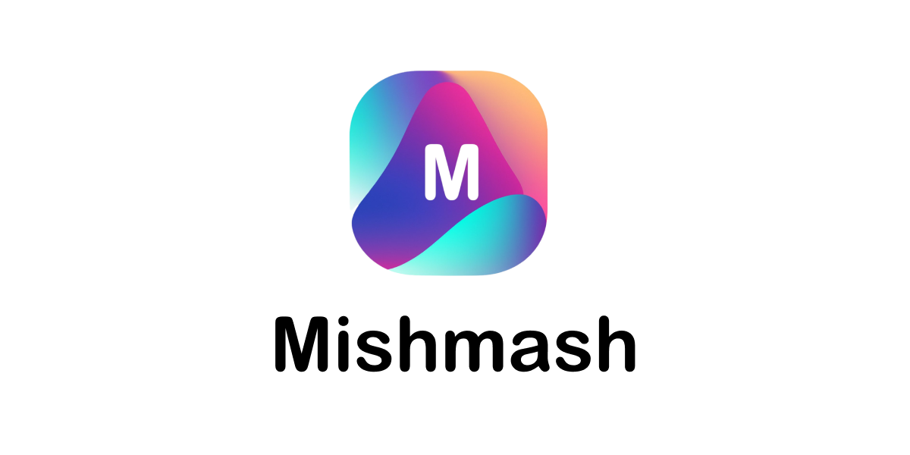

### Infinite digital content creation for everyone. [Video link!](https://vimeo.com/767690146)

Digital content creation in today's world is more demanding than ever: content has to be novel, variable and targeted for a global audience.

For example, advertisers need different versions of the same content to find out what works best. Content creators turn to users, like social media influencers to produce enough interesting content. 

However, the required variability is still hard to achieve if the content has to be created from scratch for every different target group.

We think anyone should be able to intuitively create digital content and scale it to cover all audiences. That's why we created Mishmash.

Mishmash a tool that takes the best out of generative AI to boost creativity, and the best out of coding to ensure high scalability. An infinite number of different text, video and audio can be easily generated with a short description of what's needed.

The output is structured as reusable atomic components. This is possible because the basic building blocks are similar for all types of content; mainly text blocks, visual media and audio. We call this approach "Content as Code".

Forget what you used to think was possible! The paradigm has changed, forever.

## Screenshots

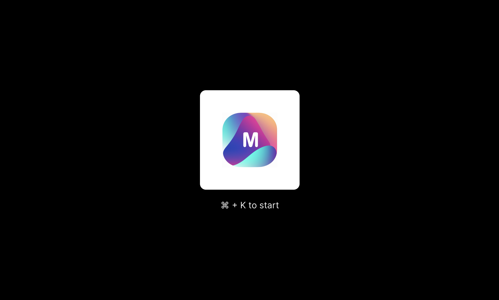
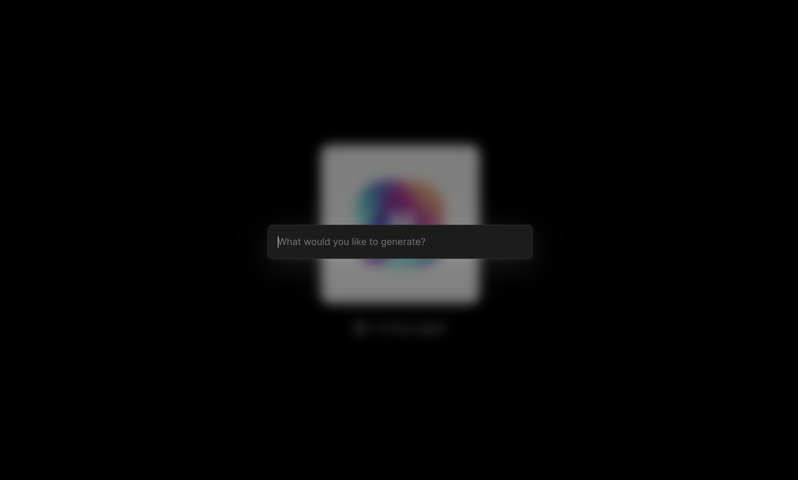
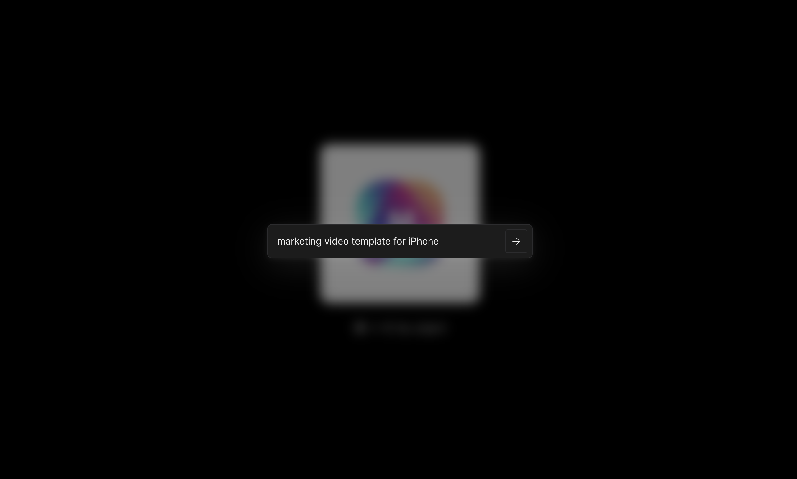
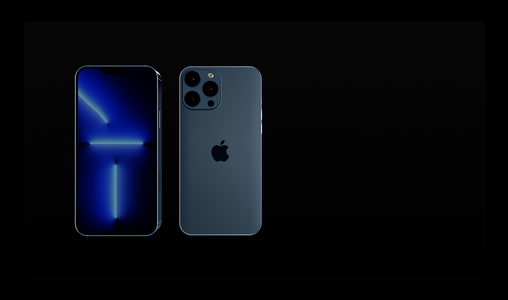
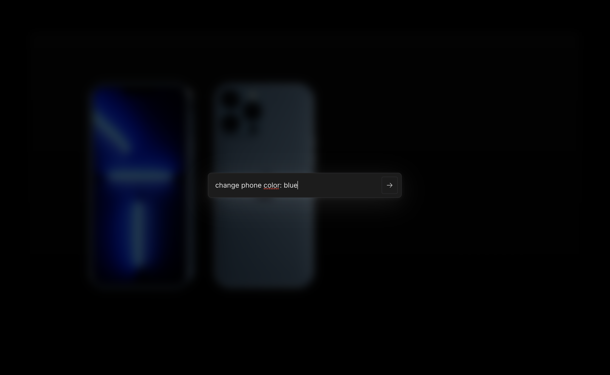
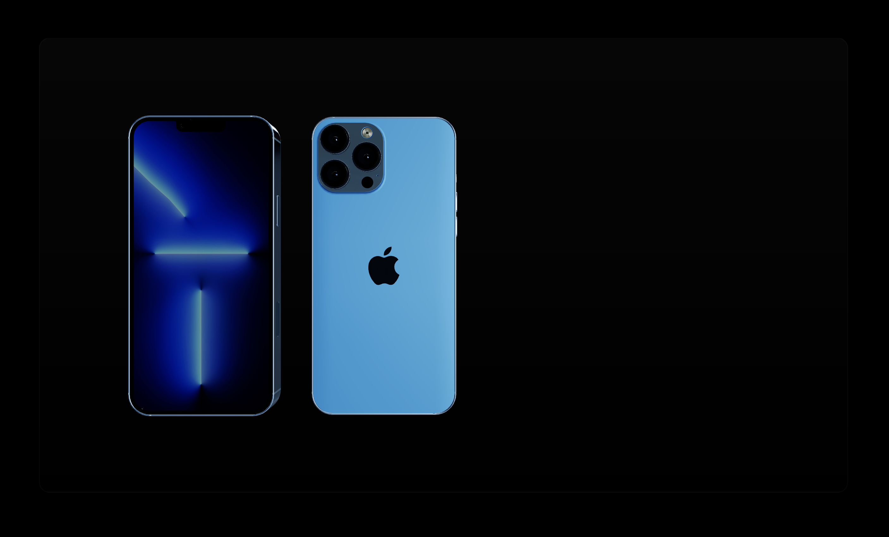
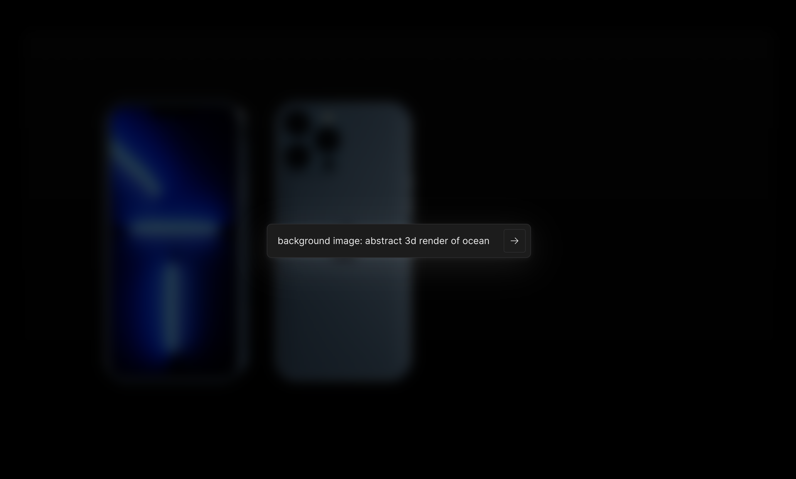
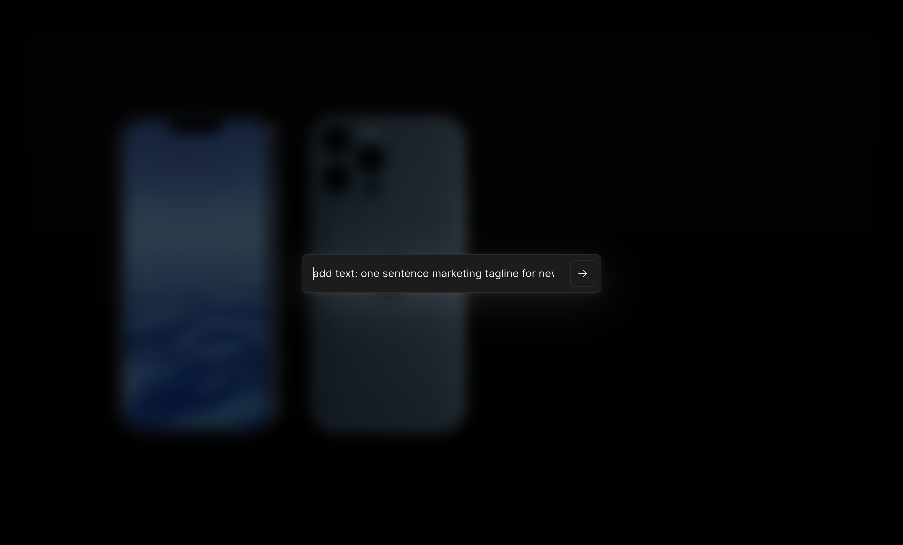
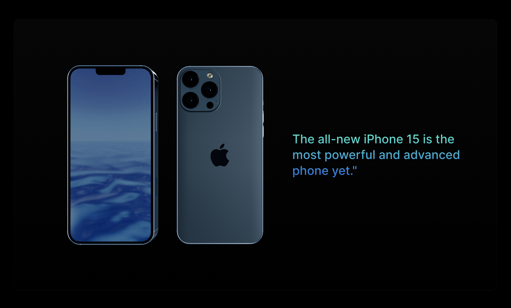
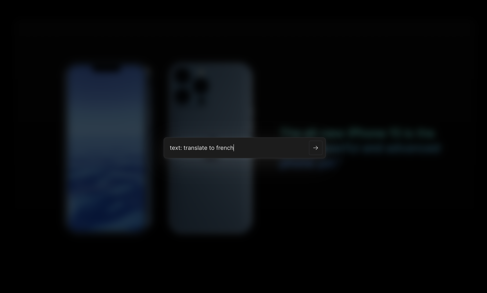
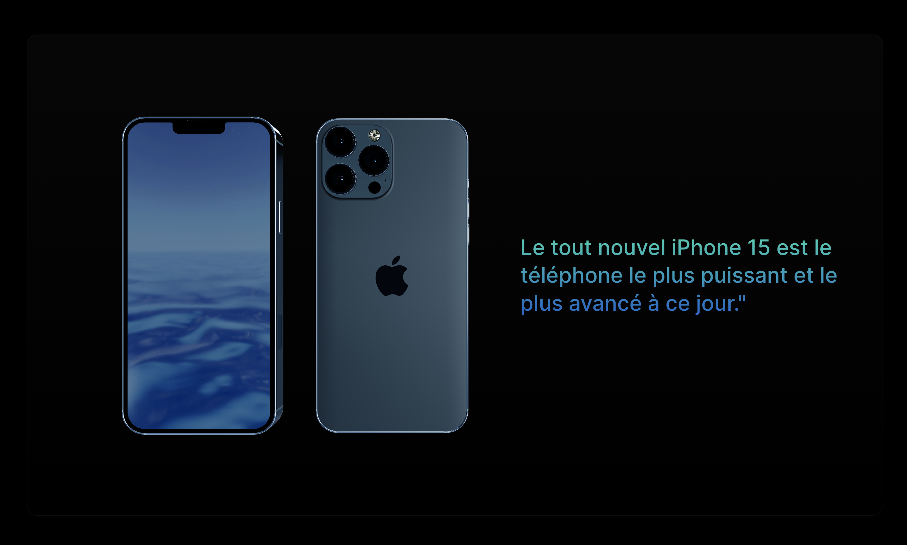
